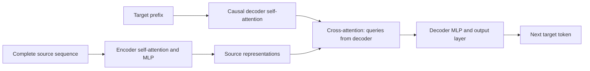

# 04 — From your decoder to an encoder–decoder Transformer

[Learning home](README.md) · Previous: [Attention](03-attention-and-your-model.md) · Next: [Experiments](05-experiments-and-building.md)

## “Decoder-only” is a design choice

Your model already contains attention, multiple heads, feed-forward networks, residual connections, and normalization. It uses a causal stack to predict the next token in a single sequence.

The original Transformer combined an encoder with a decoder for sequence-to-sequence tasks. See its architecture figure and Section 3 in [Attention Is All You Need](https://arxiv.org/html/1706.03762v7). Bob uses some different implementation choices, including learned positions and pre-normalization, so it is not a miniature line-for-line implementation of that paper.

“Full Transformer” often means this original encoder–decoder arrangement. It does not mean a decoder-only model is unfinished. Choose an arrangement based on what input is available and what output you need.

| Family | Visibility | Typical learning setup |
| --- | --- | --- |
| Encoder-only | Positions can use the whole provided input, excluding padding | Masked-token prediction, classification, representations |
| Decoder-only | Each position uses a prefix of one sequence | Next-token prediction and continuation |
| Encoder–decoder | Encoder sees source; decoder sees target prefix and encoded source | Paired input/output generation |

These are useful categories, not strict boundaries on possible tasks. A decoder-only model can also translate or summarize when trained on appropriately formatted examples.

## What does an encoder add?

Suppose the task is translating a known source sentence. All source words are already available, so each can use information from either side. Encoder self-attention produces contextualized source vectors.

The encoder does not have to compress the entire sentence into one vector. It normally outputs a sequence of vectors—one per source position—which the decoder can access.

The decoder still must generate an unknown target sequence one token at a time. Its self-attention stays causal. It also receives a second attention sublayer that reads the encoder's outputs: **cross-attention**.



Read the cross-attention arrow as “the decoder consults representations of the source.” There is no future target information on that arrow.

## Self-attention versus cross-attention

Self-attention derives Q, K, and V from the same sequence representation. Cross-attention derives Q from the decoder and K/V from the encoder:

```text
Q = decoder_state projected into query features
K = encoder_output projected into key features
V = encoder_output projected into value features
cross_result = softmax(Q Kᵀ / sqrt(dh) + source_padding_mask) V
```

If source length is `S` and target length is `T`, the score shape is `[B, H, T, S]`, not `[B, H, T, T]`. Target positions can generally consult all non-padding source positions, since the source is already known. A source causal mask is not required for this ordinary offline sequence-to-sequence setup.

## A concrete tiny task to build next

Use string reversal before trying translation:

```text
source:          a b c
decoder input:   BOS c b a
decoder targets: c b a EOS
```

`BOS` means beginning of sequence; `EOS` means end. During training, feed the correct target prefix rather than the model's sampled output—often called **teacher forcing**. Predict `c` from `BOS` plus source, then `b` from `BOS c` plus source, and so on. Shifted targets remain essential.

During inference, provide only the source and `BOS`. Generate until `EOS` or a maximum length. You cannot hand the model the reversed answer during evaluation.

Generate many random short strings and hold out unseen strings. Test both familiar lengths and longer ones. Success on training examples alone is not evidence that the model learned a reliable reversal algorithm.

## Build plan: a separate future experiment

This repository does **not** implement the following changes yet. Keep Bob working while you add an independently testable sequence-to-sequence project.

1. **Make paired data.** Store source and target separately. The current packed `.bin` format does not preserve the paired-example structure you need.
2. **Define special tokens.** For a byte vocabulary, reserve IDs beyond 255 for PAD, BOS, and EOS. Expand embeddings/output vocabulary and consistently encode/decode them. A literal string like `<EOS>` is several ordinary bytes unless explicitly assigned a special ID.
3. **Batch pairs with lengths and padding.** Make source and target padding masks. Ignore PAD target positions in the loss.
4. **Add encoder blocks.** Use unmasked self-attention over valid source tokens, normalization, residual connections, and MLPs. Add source positions.
5. **Add decoder cross-attention.** Each decoder block needs causal self-attention, then cross-attention to encoder output, then an MLP, with suitable normalization and residual paths. Add target positions.
6. **Train only target predictions.** Source tokens condition the answer. Target labels are shifted and padding does not count toward the objective.
7. **Write generation.** Encode source once, start with BOS, then generate target tokens until EOS or a length cap.
8. **Write behavioral checks.** Future target changes must not affect earlier target logits; changed source input should influence predictions; changing padded source values should not affect valid target predictions; padding labels must not alter loss.

Mask APIs differ between PyTorch attention interfaces. Before implementation, verify the particular function's boolean-mask convention and expected shapes. The conceptual rule is simple—hide padding and future targets—but translating it to an API needs care.

Start from random weights for this teaching experiment. An encoder–decoder model has new components and vocabulary requirements, so your decoder-only checkpoint is not directly interchangeable. Selectively transferring compatible weights is a more advanced design choice, not ordinary resume.

## How to measure whether it works

For reversal, report the fraction of whole held-out strings reversed exactly, plus accuracy by input length. Token-level loss helps debug optimization, but exact sequence accuracy answers whether the task is actually solved.

As a next paired task, try converting simple structured records into sentences. Translation or summarization can come later with suitable paired data and stronger evaluation.

An encoder–decoder implementation walkthrough is available in [Dive into Deep Learning's Transformer chapter](https://d2l.ai/chapter_attention-mechanisms-and-transformers/transformer.html). Read its diagram first, then trace where the encoder output enters the decoder. You can use the book as a reference without replacing this project's environment with its dependencies.

## Check yourself

1. Why can the encoder see the entire source without cheating?
2. Does cross-attention use queries from the source or the target side?
3. Why would simply removing Bob's causal mask be wrong?

**Answer hints:** the source is already supplied at inference. Queries come from decoder states; keys/values come from encoder outputs. Bob's shifted targets would become visible, and there would still be no separate encoder or cross-attention.
