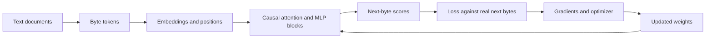

# Learn how your model works

This is a guided companion to Bob, written for someone with Calculus 1 who wants to understand and build models. You do not need to become a researcher before you start experimenting. The goal is to explain what each component does, recognize the important equations, and connect them to working code.

The [main README](../README.md) is the command manual. These notes explain **why** the commands and model work. Examples describe the current local configuration unless stated otherwise. Suggested future features are explicitly labeled; they are not implemented by these notes.

## Reading order

| Read | Main question | Suggested first-pass time |
| --- | --- | --- |
| [01 — From text to a trained model](01-text-to-model.md) | What actually happens during training and generation? | 15–20 minutes |
| [02 — The math you need](02-math-with-intuition.md) | What do vectors, probability, loss, and gradients mean? | 25–35 minutes |
| [03 — Attention inside your decoder](03-attention-and-your-model.md) | How do tokens exchange information, and what are Q, K, V? | 25–35 minutes |
| [04 — Encoder–decoder Transformers](04-encoder-decoder.md) | What would a “full Transformer” add? | 20–30 minutes |
| [05 — Learn by experimenting](05-experiments-and-building.md) | How can I tell whether a change helped? | Read 15 minutes; experiments vary |
| [06 — Study guide and resources](06-study-guide.md) | What should I study next, and what can wait? | 15 minutes; use over several weeks |

These are suggested study times, not requirements. On a first pass, read the prose and diagrams. On a second pass, read the equations and open the named Python files. Then do one experiment and explain the result in your own words.

**An important starting point:** your model already has multi-head attention. “Decoder-only” describes which Transformer components it uses; it does not mean attention is missing. An encoder–decoder model is a different way of organizing the task, not an automatic intelligence upgrade.

## A map to keep beside you

During generation, replace the loss/optimizer branch with “sample a byte, append it, predict again.” Weights remain fixed.

## What counts as understanding?

You should be able to explain why the model cannot see future answers, why a lower loss can coexist with gibberish, what a checkpoint contains, and how cross-attention differs from self-attention. You should also be able to trace a batch's dimensions without multiplying every matrix by hand.

Each chapter ends with a few self-check questions and short answer hints. Try answering before reading the hints. Keep an experiment notebook: a plain Markdown file is enough.
