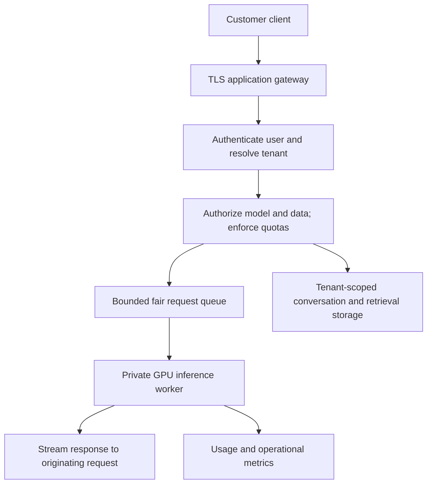

# 04 — Serving multiple customers without mixing their state

[Scaling Up](README.md) · Previous: [Efficient inference](03-efficient-inference.md)

A tenant is a customer or organization with its own identity, access permissions, and usage budget. Multiple users within one tenant can still have different access rights. Multi-tenancy is an application and operations design, not a property gained by adding an attention head or renting a larger GPU.

This page is a proposed architecture. Bob has no HTTP server, tenant database, authentication, or request scheduler yet.

## Share weights, separate request state

Many customers can use the same read-only model weights. Their prompts, generated tokens, conversation histories, random generators, retrieval results, and any KV caches must remain associated with the correct request and tenant.

Normal inference does not update the shared weights with a customer's prompt. Online training would be a separate, explicit pipeline with data ownership and isolation decisions. Never treat customer prompts as automatically approved shared training data.

The gateway is your application backend. Clients should not directly choose file paths, load model code, or call worker administration endpoints.

## Follow one request

1. Verify the credential and derive the tenant ID from server-side identity records. A `tenant_id` supplied in the request body is not proof of membership.
2. Check that the caller may use the requested model version, conversation, document collection, or adapter.
3. Validate sizes and sampling parameters. Reserve capacity or quota for the allowed maximum generation so concurrent requests cannot all spend the same remaining balance.
4. Create a server-generated request ID with tenant, user, model version, deadline, and usage reservation attached.
5. Queue fairly, run the request, and deliver its output only to the authorized caller.
6. Reconcile actual usage, release unused reservations, and clean up request buffers on completion, timeout, cancellation, or failure.

For asynchronous jobs, both status polling and result retrieval need the same ownership checks. An unguessable job ID is not a replacement for authorization. Retries need an idempotency policy to avoid duplicate jobs or double usage accounting.

## Three serving models

| Arrangement | Benefit | Tradeoff |
| --- | --- | --- |
| Shared base model and worker pool | Simple, efficient weight sharing | Requires careful request/data isolation and fair scheduling |
| Shared base with tenant-specific adapters | Customization without a whole separate base per tenant | Compatibility, adapter routing, memory, and cache lifecycle become more complex |
| Dedicated worker/model per tenant | Stronger operational separation and predictable allocation | Higher idle cost and more deployments |

Start with shared weights and tenant-scoped application data unless your requirements justify another arrangement. RAG can customize the information supplied to a request without changing shared weights. Every retrieved document must be filtered by the caller's permissions **before** being included in a prompt; a prompt instruction is not an access-control boundary.

For adapter serving, vLLM documents [LoRA support](https://docs.vllm.ai/en/latest/features/lora/). Only route to allowlisted adapters compatible with the exact base revision. Keep model/adapter version in cache and routing identities. An adapter is not a strong security boundary for sensitive data, and letting customers upload arbitrary checkpoints or remote model code is not a safe first implementation.

## Fairness and capacity limits

One long request can monopolize resources unless you bound work. Requests per minute alone is not enough: a tiny prompt and a very long completion have different costs.

Enforce per-tenant active-request limits, input/output length caps, queue limits, and usage budgets. Schedule across tenants rather than allowing one tenant to occupy every queue slot. Track both queue delay and GPU execution latency so a capacity problem is not mistaken for slow model computation.

Load-test a “noisy neighbor”: tenant A floods long requests while tenant B sends short ones. Set a measurable target for B's latency and verify the scheduling policy. Reserve GPU memory headroom; capacity is constrained by weights, cache/activations, and runtime overhead, not just the number of HTTP connections.

## Isolation extends beyond the prompt

| State | Isolation requirement |
| --- | --- |
| Conversation history | Tenant and user/conversation authorization on every read/write |
| Retrieval/vector storage | Tenant-scoped queries plus document permissions |
| Response or prefix cache | Tenant scope and correct model/tokenizer/adapter identity; disable sharing until verified |
| RNG and generation buffers | Per-request state, not a globally reset seed shared by concurrent callers |
| Logs | Metadata by default; raw prompt/output retention only by explicit policy |
| Artifacts and adapters | Approved immutable versions with restricted storage access |
| Metrics and billing | Attribute requests to the tenant without exposing other tenants' data |

Bob's CLI calls `torch.manual_seed()` and handles one request. A concurrent service should not reset global randomness on every request. It also needs bounds on memory allocated from untrusted request sizes.

A cache can leak information through responses or timing even if weights are shared safely. Treat cache partitioning as part of isolation, not just an optimization. The [vLLM security guide](https://docs.vllm.ai/en/latest/usage/security/) discusses network exposure, API-key limitations, resource limits, and cache concerns. Keep backend/admin ports private and put application authorization in front; an engine API key is not a complete tenant system.

## A staged implementation plan

**Milestone 1 — private prototype:** load one Bob model once, implement a bounded completion endpoint, and run it behind an authenticated application boundary. Serial GPU execution is acceptable while proving request handling.

**Milestone 2 — two test tenants:** add server-side membership, tenant-scoped storage, usage reservations, a fair queue, and cancellation. Use synthetic tenant data and deliberately try cross-tenant access.

**Milestone 3 — efficient worker:** benchmark realistic concurrency. Add batching or move a compatible model to a serving engine. Keep the tenant policy layer independent of the GPU implementation.

**Milestone 4 — release operations:** version artifacts, perform readiness checks, route a small share of traffic to a new version, monitor quality and latency, and roll back if needed. Drain in-flight requests before unloading an old worker. A new replica is ready only after loading and passing a generation check.

**Milestone 5 — paid workload:** verify quota accounting, bounded spend, data retention/deletion behavior, and restore/rollback drills under expected load. Scale based on measured capacity and queue delay rather than an assumed customer count per GPU.

## Acceptance exercises

- Tenant A cannot read B's conversation, job result, retrieval document, or adapter, including by substituting IDs.
- A malformed or huge request is rejected before exhausting GPU memory.
- Cancelling a stream stops its generation and releases resources.
- A flood from A does not bypass B's scheduling allocation.
- Worker restarts/retries do not double-bill one logical job.
- Switching model versions cannot reuse incompatible cached state.
- Restoring the previous release returns service without overwriting either artifact.

You do not need Kubernetes or many GPUs for the first version. You do need a clear answer to: **who may access this data, how much work may they request, and which exact model answered?**
