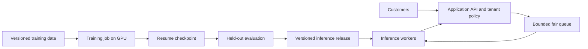

# Scaling Up — from a local experiment to a model service

[Learning home](../README.md) · [Command reference](../../README.md)

Training a larger model and serving many users are related but separate engineering jobs. A training machine changes weights. An inference worker loads a chosen version of those weights and answers requests. A multi-tenant application controls which customer can send which requests and access which data.

This section connects those jobs without assuming you already know cloud infrastructure.

| Page | What you will learn |
| --- | --- |
| [01 — RunPod and larger training runs](01-runpod-training.md) | Move Bob to a GPU, size an experiment, resume work, and decide between scratch training and adaptation |
| [02 — Save, package, and recover weights](02-checkpoints-and-releases.md) | Distinguish resume checkpoints from inference artifacts, back up files, verify restores, and version releases |
| [03 — Efficient inference](03-efficient-inference.md) | Load once, batch requests, understand KV caching, and move toward a supported serving engine |
| [04 — Multi-tenant serving](04-multi-tenant-serving.md) | Share GPU capacity while separating identity, data, quotas, model versions, and request state |

Read them in order. Each is roughly a 15–25 minute first pass; hands-on work takes longer.

## What works now versus what you would build

**Works with this repository today:** a single-GPU training loop, automatic compatible-CUDA BF16 autocast, timed training, periodic resume checkpoints, inference using `generate.py`, and readable weight exports. The H100 config has **10,942,464 parameters**; the local config has **875,264**.

**Design guidance in these pages, not implemented features:** an HTTP API, authentication, request queues, continuous batching, KV caching, tenant isolation, distributed training, LoRA adapters, and a model-release registry. The inference-only export in page 02 is a runnable tutorial snippet, not a new command-line script.

**Not validated here:** RunPod deployment, H100 performance, and the proposed larger configuration. Existing local tests do not establish cloud throughput or production readiness. No cloud resources are created by reading or adding these notes.

## The lifecycle

An inference release is deliberately selected. It should not silently change whenever a training process overwrites its latest checkpoint.

## A practical route

First run Bob unchanged on one GPU and prove you can restore the checkpoint elsewhere. Next measure a slightly larger model against your baseline. Then create a private, single-worker inference service. Add tenant identity, limits, and tests before serving multiple customers. Move to a specialized serving engine only after selecting a compatible model and measuring the need.

For a useful application, adapting an existing pretrained model may be a shorter path than training a capable general model from scratch. Keeping Bob as your learning implementation and building a separate application project is a reasonable progression.
